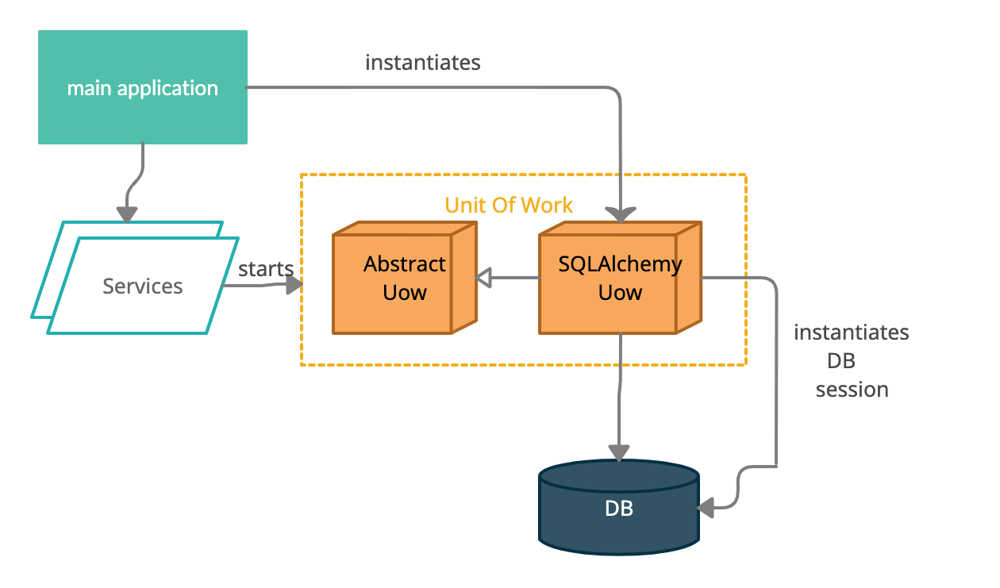

# Pulling Data Out of Oracle database with Python using SQLAlchemy and Unit of Work Design Pattern

In this tutorial style article we are going to provide you with some steps to connect to an Oracle database in a Python application by using SQLAlchemy ORM (Object relational mapping) and the Unit of Work Design Pattern. By the end of it you will be able to perform queries using raw SQL commands along with some Python features such as encapsulating your queries in classes and methods according to business rules domains and making your code more flexible and reusable by concatenating python variables in your queries commands using the format method.


## Introduction 

Oracle is one of the most popular databases out there, it's used by companies like JPMorgan Chase, IBM, ABN Amro, Wells Fargo and so on. Considering this, the are good chances that one day you might bump into it in your ephemeral life as a software developer. 

It can be pretty daunting to have to use repetitive SQL commands to search for specific information in databases, right? For simple and quick tasks it's fine to use a software like Oracle SQL Developer to perform your queries, but if you are working on a specific application with more complicated business rules, then you might want to condense those repetitive SQL commands in a method, for example. If you are writing an application in Python which might need to query an Oracle database, follow me through the next steps to check out my approach to this.

## Why use SQLAlchemy?

SQLAlchemy is a library used to interact with a wide variety of databases such as Postgres, MySQL, SQLite, Oracle, and many others. It enables you to create data models and queries in a manner that feels like normal Python classes and statements. It's considered by many the main way of working with relational databases in Python. 

[The top reason to use SQLAlchemy is to abstract your code away from the underlying database and its associated SQL peculiarities. SQLAlchemy leverages powerful common statements and types to ensure its SQL statements are crafted efficiently and properly for each database type and vendor without you having to think about it. This makes it easy to migrate logic from Oracle to PostgreSQL or from an application database to a data warehouse. It also helps ensure that database input is sanitized and properly escaped prior to being submitted to the database. This prevents common issues like SQL injection attacks.][1]

I hope you find it interesting so far. Now let's get our hands a bit dirty.

## Step 1: Creating a Python Environment and Installing Python Libraries

In this section we are going to create a virtual environment to install our dependencies. This avoids us to install our packages into a global Python environment.

Create a folder for your project and in that folder use the following commands according to your operational system.
In the example below ".env" is the name of the environment:

```bash
# macOS/Linux
sudo apt-get install python3-venv  # If needed
python3 -m venv env

# Windows
python -m venv env
```

Activate the virtual environment:

```bash
#(Linux/macOS)
source env/bin/activate 

#Windows)
env\scripts\activate 
```

You know the environment is activated when the command prompt shows **(env)** at the beginning.

The python libraries we need to connect to an Oracle database are essentially `cx_Oracle` and `sqlalchemy`, let's place them in our requirements.txt file in the root folder of our project:

*requirements.txt*
```bash
# These libraries are required to run the script
cx_Oracle
sqlalchemy
python-dotenv
```

To install the packages, you can just run:

`pip install -r requirements.txt`

If you would like to install them individually, just do:

`pip install <somepackage>`

## STEP 2: Installing Database Drivers

[By default, SQLAlchemy will support SQLite3 with no additional drivers; however, an additional database driver that uses the standard Python DBAPI (PEP-249) specification is needed to connect to other databases. These DBAPIs provide the basis for the dialect each database server speaks and often enable the unique features seen in different database servers and versions.][1]

[cx_Oracle](https://docs.sqlalchemy.org/en/14/dialects/oracle.html#module-sqlalchemy.dialects.oracle.cx_oracle) is one dialect(DBAPI) option available which adds support for the Oracle database.
All you have to do is go to the cx_Oracle official webpage (https://oracle.github.io/python-cx_Oracle/) download and install the proper driver according to your operational system. 

## STEP3: Test  your database connection credentials before start the coding

Make sure you have all the necessary information to connect to your database. A connection string provides information about:

* Database type (Postgres, MySQL, Oracle etc.)  
* Dialect (Psycopg2, PyMySQL, cx_Oracle etc.)  
* Location of the database (file or hostname of the database server)
* Authentication details (username and password) [optional] 
* Database server port [Optional]
* Database name [optional]

If you have the Oracle SQL Developer software installed in your machine you can test your connection by providing this information through a manual connection. 


If after that you are able to successfully connect to the database and see the schemas and tables you are interested in, then you are good to go to the next steps.

## STEP4: Creating a ".env" File to Store Information About Your Database Connection

It's a good practice to create a `.env` file to store sensitive information about your project. This way, your application will become less vulnerable to malicious attacks. Each developer involved in the creation of the project should create their own `.env` file in which they will place their credentials to the database, see template below.

*.env*
```
export PYTHONPATH="~/<project_path>"

export DB_HOST=<your_db_hostname>
export DB_USER=<your_db_hostname>
export DB_SERVICE=<your_db_service_name>
export DB_PASSWORD=<your_db_password>
export DB_PORT=<your_db_port>
```

Usually this file is placed in the the root folder of our project.

## STEP 5: CREATING A CONFIG FILE

Now, let's create a `config.py` file which will read the database credentials

*src/config.py*
```python
import pathlib
from os import environ, path
 
from dotenv import load_dotenv
 
PROJECT_ROOT = pathlib.Path(__file__).parent.parent.absolute()
 
load_dotenv(path.join(PROJECT_ROOT, ".env"))
 
 
def get_oracle_db_uri() -> str:
   """
   Load database environment variables from .env
   :return: string db connection
   """
   host = environ.get("DB_HOST")
   user = environ.get("DB_USER")
   password = environ.get("DB_PASSWORD")
   service_name = environ.get("DB_SERVICE")
   port = environ.get("DB_PORT")
   return f"oracle+cx_oracle://{user}:{password}@{host}:{port}/{service_name}"
```


## STEP 6: Connecting to the Database

Now that we have SQLAlchemy and a DBAPI installed, let’s actually build an engine to connect to a database.

The SQLAlchemy engine creates an interface to the database to execute SQL statements. This enables our Python code not to worry about the differences between databases or DBAPIs.


CREATING YOUR DATA ACCESS LAYER
Create your Unit of Work classes
Create you query classes
Tricks for maintainability and reusability


## The Unit of Work Design Pattern?

You can change the database with each change to your object model, but this can lead to lots of very small database calls, adding latency to your system, mainly if a lot of communication happens across the layers of your infrastructure.

While performing CRUD operations you can use the Unit of Work to check for inconsistencies by verifying that none of the objects changed on the database during the business transaction. When it comes time to commit, it figures out everything that needs to be done to alter the database as a result of your work. It opens a transaction, does any concurrency checking and writes changes out to the database. 

The Unit of Work(UoW, which we pronounce “you-wow”) allows us to decouple our service layer from the data layer. 


[The obvious things that cause you to deal with the database are changes: new object created and existing ones updated or deleted. Unit of Work is an object that keeps track of these things. As soon as you start doing something that may affect a database, you create a Unit of Work to keep track of the changes. Every time you create, change, or delete an object you tell the Unit of Work. You can also let it know about objects you’ve read so that it can check for inconsistent reads by verifying that none of the objects changed on the database during the business transaction.][2]

The Unit of Work (UoW) pattern is our abstraction over the idea of atomic operations . 


Here’s how the service layer will look when we’re finished: 

*unit_of_work.py*
```python
import abc

from sqlalchemy import create_engine
from sqlalchemy.orm import sessionmaker
from sqlalchemy.orm.session import Session

from src import config


class AbstractUnitOfWork(abc.ABC):
    def __enter__(self):
        return self

    def __exit__(self, *args):
        self.rollback()

    def commit(self):
        self._commit()

    @abc.abstractmethod
    def _commit(self):
        raise NotImplementedError

    @abc.abstractmethod
    def rollback(self):
        raise NotImplementedError


DEFAULT_SESSION_FACTORY = sessionmaker(
    bind=create_engine(
        config.get_oracle_db_uri(), max_identifier_length=128, pool_timeout=30
    )
)


class SqlAlchemyUnitOfWork(AbstractUnitOfWork):
    def __init__(self, session_factory=DEFAULT_SESSION_FACTORY):
        self.session_factory = session_factory

    def __enter__(self):
        self.session = self.session_factory()  # type: Session
        return super().__enter__()

    def __exit__(self, *args):
        super().__exit__(*args)
        self.session.close()

    def _commit(self):
        self.session.commit()

    def rollback(self):
        self.session.rollback()

```

When we are done we commit or roll back the work using UoW. It acts as a single entrypoint to our persistence storage and it keeps track of what objects were loaded and of the latest state.

This gives us three useful things: 

* A stable snapshot of the database to work with, so the objects we use aren’t changing halfway through an operation
* A way to persist all of our changes at once, so if something goes wrong, we don’t end up in an inconsistent state
* A simple API to our persistence concerns and a handy place to get a repository


## General Architecture of the System

The unit of work is going to be initialized in the main application, which invokes the services, which collaborates with the UoW.



## Resources

[1]: Copeland, R. (2008). Essential SQLAlchemy. Sebastopol, CA: O’Reilly Media. 
[2]: Fowler, M. (2002). Patterns of Enterprise Application Architecture. Boston, MA: Addison-Wesley Educational. 
[3]: PERCIVAL, HARRY. ENTERPRISE ARCHITECTURE PATTERNS WITH PYTHON: O'REILLY MEDIA, 2020. 
[4]: https://docs.sqlalchemy.org/en/14/dialects/oracle.html 
[5]: https://oracle.github.io/python-cx_Oracle/
[6]: https://docs.sqlalchemy.org/en/14/dialects/oracle.html
[Flask Tutorial in Visual Studio Code](https://code.visualstudio.com/docs/python/tutorial-flask)


